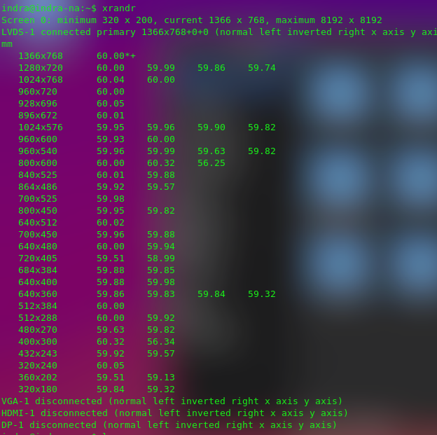
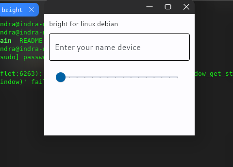
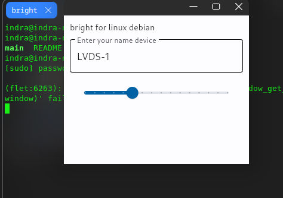

# Debian Brightness controller

## how to using controller
1. download debian brightness
```bash
git clone https://github.com/RajaSunrise/debian-brightness
```

2. open folder brightness
```bash
cd debian-brightness
```

3. check your name device
```bash
xrandr            # command to check 
```


4. search connected primary
```
my device connect in name LVDS-1
```

5. Run brightness controller
```bash
sudo ./main
```


6. enter your name device and scroll slider


## Thank You 